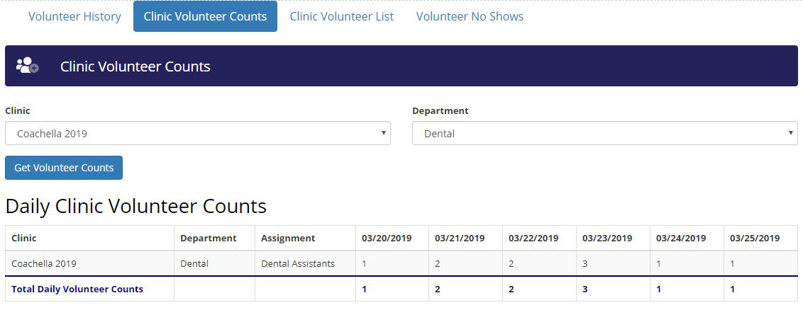
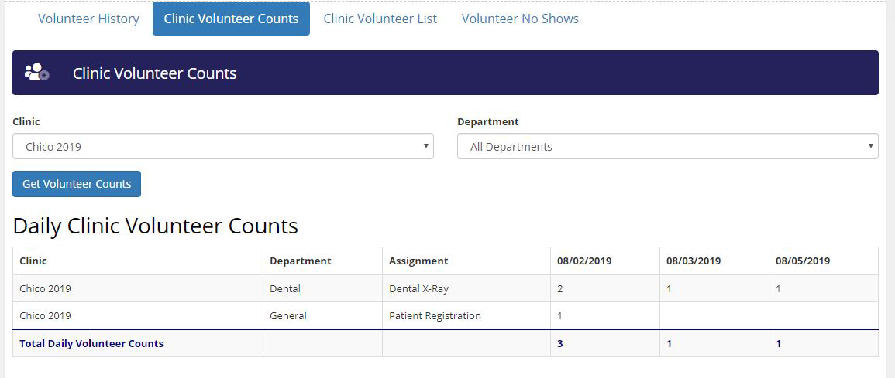
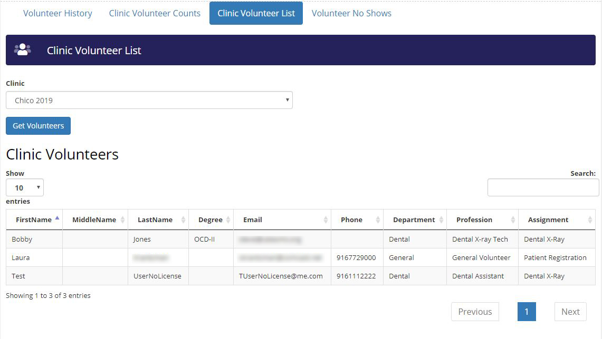

# Dynamically Built Tables With Subtotals and DataTables Functionality
I created a Javascript/jQuery script that uses a few functions to create dynamic html tables (unknow number of columns and unknown column headings/data types), with an optional subtotals row, from a JSON feed. The main function is called CreateDynamicTable(), which accepts parameters used in a getJSON call to return the JSON encoded data needed for the table, as well as properties on how the table should be displayed. The DataTable jQuery plugin can also be used to add additional functionality to the tables.

## The Basics
I use the getJSON() AJAX call on a JSON feed to return JSON encoded data. You could use any method you wanted, to get your JSON data. I then dynamically build the table structure by creating the table element, and then I add additional elements to it. I first loop through the first JSON object to create the table head elements, and then I loop through the entire JSON dataset to create the body elements. Then I wrap it all up by adding the function to subtotal the results in the last row element of the table (this is optional.) Then the new table element is added to the div element of my choice on the page. Additionally, I use a jQuery plugin called DataTables (https://datatables.net/) to add a great deal of functionality to the tables (if needed), such as searching, sorting, and pagination. *You will need to add code to initialize the DataTable plugin at the top of your page (I use the DataTables CDN https://cdn.datatables.net/ see the DataTables documentation).* 

## The Disclaimer
I cannot take credit for writing all of this code, as several snippets of it came from internet searches. The resources are as follows:
  * Convert JSON Data Dynamically to HTML Table... by Arun Banik at https://www.encodedna.com/javascript/populate-json-data-to-html-table-using-javascript.htm
  * Create Sutotals and Totals For Columns in a Table... by Nikolajbaer at https://gist.github.com/nikolajbaer/778800
  * DataTables jQuery Plugin... by SpryMedia Ltd. at https://datatables.net
  
What I can take credit for is, uniquely combining those code snippets with my own code to dynamically generate html tables with subtotals from JSON with DataTables functionality added.

##  The Detail
Here is the script file: https://github.com/skrantzman/Dynamic-Datatables-With-Subtotals/blob/master/Dynamic%20Tables%20with%20Subtotals.js.  An explanation of one of the pages that I use this script on, is below. Although I have comments throughout the script, this may be helpful in understanding the code structure,how it works, and why it is even needed.

This script runs on a reports page, for an organization that utilizes volunteers to put on remote clinics. Each clinic consists of multiple departments, which consists of multiple assignments, and the clinic may run from one to any numbers of days. As each clinic is different, you would have to agree that we never know how many days are going to be in the report/table until we set the parameters and run the report. 

The following report reflects Clinic Volunteer Counts. The first row (table header) in the table contains our field names, with each row in the table thereafter containing data for ClinicName, DepartmentName, AssignmentName, VolunteerCountForAssignmentDay1, VolunteerCountForAssignmentDay2,... through, VolunteerCountForAssignmentDay6. The last row (table footer) showing the column totals if any.



On the Clinic Volunteer Counts reports tab, in addition to being able to specify a specific department for a specific clinic, there is also an option in the Department dropdown list for "All Departments". The following report has this option selected, but with a different clinic selected, that has fewer days than the previous. As you can see, the table dynamically adjusted the number of columns based on the amount of days that this clinic ran for, as well as the date headings.



This html page has several tabs, and each tab is a different report.  Each report has a submit button that calls its own function on the OnClick event for the button. Those functions then call the GenerateDynamicTable() function, and pass to it the needed connection and filter values, as parameters, for that report's getJSON call. This is one of the reason that I have so many input parameters in the CreateDynamicTable() function.  This allows me to reuse the GenerateDynamicTable() function for any type of data, with any number of columns, to dynamically create my html tables, for as many reports as I want. 

Below is another report, but this time from the Clinic Volunteer List tab, that also uses the CreateDynamicTable() function. Notice that there is only one filter (dropdown list control), and the resulting table has searching, sorting, and pagination enabled. This is done by adding the tblid parameter which adds an ID to the table as well as the DataTable class to the table element. The data is totally different than the previous examples, as it is showing volunteer information. I can switch between having two dropdown list controls for filtering data, to one, as the parameters of the second dropdown list are optional input parameters. Regardless, you can see that the table is still generated correctly given its specific dataset. 



The data used for all these various reports is very dynamic, as we never know how many columns the data will contain, or what the data represents for that matter. Hence the need to dynamically generate the html table structure, as well as populate the html table with the data. I believe that this script successfully accomplishes just that.

##  The Function's Input Parameters Defined
Here is a brief description of what each of the CreateDynamicTable() function's input parameter represent.
 * **target**: (string) The ID of the html DIV element where you want your table to appear in, on the page, i.e. "ShowVolCounts".
 * **heading**: (string) The Heading you want to appear above your table, i.e. "Daily Clinic Volunteer Counts".
 * **tblid**: (string, optional - default value = "") ID value for the created table, if needed, i.e. "tblVolCounts" 
 * **subtotal**: (boolean) determins if the subtotal row is visible in the table footer, i.e. True.
 * **XFD**: (string) Name of the JSON feed for the getJSON() call, i.e. "GetDailyAssignVolCountsJSON".
 * **p1Name**: (string) The class name of the first ddl control to filter by, i.e. "ddlClinicID"
 * **p1**: (integer) The selected value of the first ddl control. i.e. $('.ddlClinicID').val()
 * **p2Name**: (string, optional - default value = ddl2) The class name of the second ddl control to filter by, i.e. "ddlDeptID" 
 * **p2**: (integer, optional - default value = 0) The selected value of the second dropdown list control. i.e. $('.ddlDeptID').val()
 
*The p2Name and p2 parameters are optional as some reports only have one filter value. Tblid is also optional as this only needs to be provided if you need to refer to that specific table by id for additional programing or styling; or to enable the DataTables functionality by adding the DataTable class to the table element.*

*__The XFD, p1, and p2 parameters will need to be structured differently in <ins>your</ins> function, as well as your JSON call, based on the method you use to obtain your JSON data__*

## A Sample Function for a Report's Submit Button onClick Event
```javascript
  // Get Volunteer Counts Table with Totals 
  function GetVolCounts() {
    var target = "ShowVolCounts",
        heading = "Daily Clinic Volunteer Counts",
        tblid = "",
        subtotal = true,
        XFD = "GetDailyAssignVolCountsJSON",
        p1Name = "ddlClinicID",
        p1 = $('.ddlClinicID').val(),
        p2Name = "ddlDeptID",
        p2 = $('.ddlDeptID').val();
    
    CreateDynamicTable(target, heading, tblid, subtotal, XFD, p1Name, p1, p2Name, p2);
  }
  ```

I hope this helps with your dynamic table with subtotals creation.

